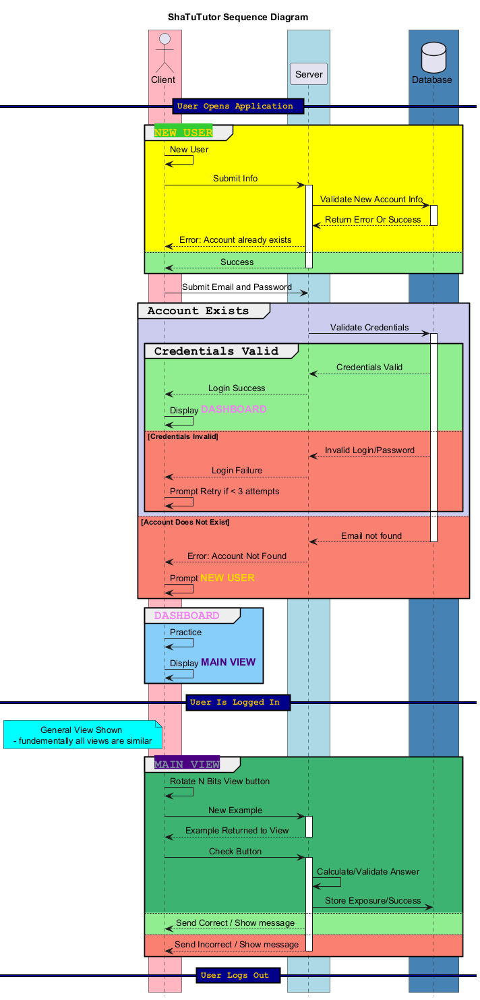
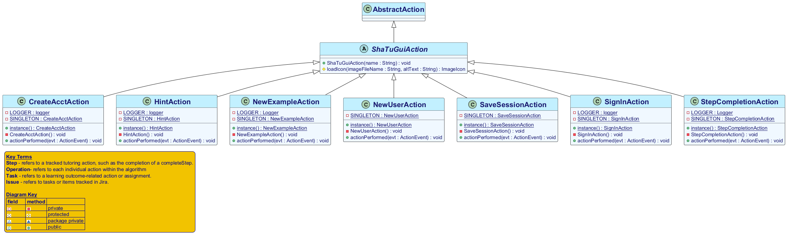

# Sha256TutorUML (WIP)
###### *(When I get my other projects moving, I'd like to come back to this and clean it up with more functionality. As I'll be using it for my own projects.)*

#### This college capstone project did not have any documentation when we started. I took the initiative of finding a scaleable solution that future classes could use. We were assigned certain views to work on, but the shear number of classes in the project made it very difficult for students to find their assigned classes.
---
## USE:
### You'll need [PlantUML](https://plantuml.com/starting) and a text editor that supports PlantUML.  
###### *(if you want a viewable diagram generated while you code it, otherwise, notepad works fine)*  
##### I've used, and had good experiences with:  
[![VS Code Extension](https://img.shields.io/badge/VS%20Code-PlantUML-green??style=flat-square&logo=data:image/svg+xml;base64,PHN2ZyB4bWxucz0iaHR0cDovL3d3dy53My5vcmcvMjAwMC9zdmciIGZpbGw9Im5vbmUiIHZpZXdCb3g9IjAgMCAyNCAyNCI+PG1hc2sgaWQ9ImEiIHdpZHRoPSIxMDAiIGhlaWdodD0iMTAwIiB4PSIwIiB5PSIwIiBtYXNrLXR5cGU9ImFscGhhIiBtYXNrVW5pdHM9InVzZXJTcGFjZU9uVXNlIj48cGF0aCBmaWxsPSIjZmZmIiBmaWxsLXJ1bGU9ImV2ZW5vZGQiIGQ9Ik03MSA5OS4zYTYuMiA2LjIgMCAwIDAgNC45LS4ybDIwLjYtOS45YTYuMyA2LjMgMCAwIDAgMy41LTUuNlYxNi40YTYuMyA2LjMgMCAwIDAtMy41LTUuNkw3NS45LjhhNi4yIDYuMiAwIDAgMC03LjEgMS4zTDI5LjQgMzggMTIuMiAyNWE0LjIgNC4yIDAgMCAwLTUuMy4xbC01LjUgNWE0LjIgNC4yIDAgMCAwIDAgNi4yTDE2LjIgNTAgMS40IDYzLjZhNC4yIDQuMiAwIDAgMCAwIDYuMWw1LjUgNWE0LjIgNC4yIDAgMCAwIDUuMy4zbDE3LjItMTMgMzkuNCAzNmE2LjIgNi4yIDAgMCAwIDIuMSAxLjN6bTQtNzJMNDUuMSA1MGwzMCAyMi43VjI3LjNaIiBjbGlwLXJ1bGU9ImV2ZW5vZGQiLz48L21hc2s+PGcgbWFzaz0idXJsKCNhKSIgdHJhbnNmb3JtPSJtYXRyaXgoLjIgMCAwIC4yIDAgMCkiPjxwYXRoIGZpbGw9IiMwMDY1YTkiIGQ9Ik05Ni41IDEwLjggNzUuOS44YTYuMiA2LjIgMCAwIDAtNy4yIDEuM0wxLjMgNjMuNmE0LjIgNC4yIDAgMCAwIDAgNi4xbDUuNSA1YTQuMiA0LjIgMCAwIDAgNS4zLjNsODEuMy02MS42YzIuNy0yLjEgNi42LS4yIDYuNiAzLjN2LS4zYTYuMyA2LjMgMCAwIDAtMy41LTUuNnoiLz48ZyBmaWx0ZXI9InVybCgjYikiPjxwYXRoIGZpbGw9IiMwMDdhY2MiIGQ9Im05Ni41IDg5LjItMjAuNiAxMGE2LjIgNi4yIDAgMCAxLTcuMi0xLjNMMS4zIDM2LjRhNC4yIDQuMiAwIDAgMSAwLTYuMWw1LjUtNWE0LjIgNC4yIDAgMCAxIDUuMy0uM2w4MS4zIDYxLjZjMi43IDIuMSA2LjYuMiA2LjYtMy4zdi4zYTYuMyA2LjMgMCAwIDEtMy41IDUuNnoiLz48L2c+PGcgZmlsdGVyPSJ1cmwoI2MpIj48cGF0aCBmaWxsPSIjMWY5Y2YwIiBkPSJNNzUuOSA5OS4xYTYuMiA2LjIgMCAwIDEtNy4yLTEuMmMyLjQgMi4zIDYuMy43IDYuMy0yLjZWNC43YzAtMy4zLTQtNS02LjMtMi42QTYuMiA2LjIgMCAwIDEgNzYgLjlsMjAuNiA5LjlhNi4zIDYuMyAwIDAgMSAzLjUgNS42djY3LjJhNi4zIDYuMyAwIDAgMS0zLjUgNS42eiIvPjwvZz48cGF0aCBmaWxsPSJ1cmwoI2QpIiBmaWxsLXJ1bGU9ImV2ZW5vZGQiIGQ9Ik03MC45IDk5LjNhNi4yIDYuMiAwIDAgMCA1LS4ybDIwLjUtOS45YTYuMyA2LjMgMCAwIDAgMy41LTUuNlYxNi40YTYuMyA2LjMgMCAwIDAtMy41LTUuNkw3NS44LjhhNi4yIDYuMiAwIDAgMC03IDEuM0wyOS4yIDM4IDEyIDI1YTQuMiA0LjIgMCAwIDAtNS4zLjFsLTUuNSA1YTQuMiA0LjIgMCAwIDAgMCA2LjJMMTYuMiA1MCAxLjMgNjMuNmE0LjIgNC4yIDAgMCAwIDAgNi4xbDUuNSA1YTQuMiA0LjIgMCAwIDAgNS4zLjNsMTcuMi0xMyAzOS40IDM2YTYuMiA2LjIgMCAwIDAgMi4yIDEuM3ptNC03Mkw0NSA1MGwzMCAyMi43WiIgY2xpcC1ydWxlPSJldmVub2RkIiBvcGFjaXR5PSIuMyIgc3R5bGU9Im1peC1ibGVuZC1tb2RlOm92ZXJsYXkiLz48L2c+PGRlZnM+PGZpbHRlciBpZD0iYiIgd2lkdGg9IjExNi43IiBoZWlnaHQ9IjkyLjIiIHg9Ii04LjQiIHk9IjE1LjgiIGNvbG9yLWludGVycG9sYXRpb24tZmlsdGVycz0ic1JHQiIgZmlsdGVyVW5pdHM9InVzZXJTcGFjZU9uVXNlIj48ZmVGbG9vZCBmbG9vZC1vcGFjaXR5PSIwIiByZXN1bHQ9IkJhY2tncm91bmRJbWFnZUZpeCIvPjxmZUNvbG9yTWF0cml4IGluPSJTb3VyY2VBbHBoYSIgdmFsdWVzPSIwIDAgMCAwIDAgMCAwIDAgMCAwIDAgMCAwIDAgMCAwIDAgMCAxMjcgMCIvPjxmZU9mZnNldC8+PGZlR2F1c3NpYW5CbHVyIHN0ZERldmlhdGlvbj0iNC4yIi8+PGZlQ29sb3JNYXRyaXggdmFsdWVzPSIwIDAgMCAwIDAgMCAwIDAgMCAwIDAgMCAwIDAgMCAwIDAgMCAwLjI1IDAiLz48ZmVCbGVuZCBpbjI9IkJhY2tncm91bmRJbWFnZUZpeCIgbW9kZT0ib3ZlcmxheSIgcmVzdWx0PSJlZmZlY3QxX2Ryb3BTaGFkb3ciLz48ZmVCbGVuZCBpbj0iU291cmNlR3JhcGhpYyIgaW4yPSJlZmZlY3QxX2Ryb3BTaGFkb3ciIHJlc3VsdD0ic2hhcGUiLz48L2ZpbHRlcj48ZmlsdGVyIGlkPSJjIiB3aWR0aD0iNDcuOSIgaGVpZ2h0PSIxMTYuMiIgeD0iNjAuNCIgeT0iLTguMSIgY29sb3ItaW50ZXJwb2xhdGlvbi1maWx0ZXJzPSJzUkdCIiBmaWx0ZXJVbml0cz0idXNlclNwYWNlT25Vc2UiPjxmZUZsb29kIGZsb29kLW9wYWNpdHk9IjAiIHJlc3VsdD0iQmFja2dyb3VuZEltYWdlRml4Ii8+PGZlQ29sb3JNYXRyaXggaW49IlNvdXJjZUFscGhhIiB2YWx1ZXM9IjAgMCAwIDAgMCAwIDAgMCAwIDAgMCAwIDAgMCAwIDAgMCAwIDEyNyAwIi8+PGZlT2Zmc2V0Lz48ZmVHYXVzc2lhbkJsdXIgc3RkRGV2aWF0aW9uPSI0LjIiLz48ZmVDb2xvck1hdHJpeCB2YWx1ZXM9IjAgMCAwIDAgMCAwIDAgMCAwIDAgMCAwIDAgMCAwIDAgMCAwIDAuMjUgMCIvPjxmZUJsZW5kIGluMj0iQmFja2dyb3VuZEltYWdlRml4IiBtb2RlPSJvdmVybGF5IiByZXN1bHQ9ImVmZmVjdDFfZHJvcFNoYWRvdyIvPjxmZUJsZW5kIGluPSJTb3VyY2VHcmFwaGljIiBpbjI9ImVmZmVjdDFfZHJvcFNoYWRvdyIgcmVzdWx0PSJzaGFwZSIvPjwvZmlsdGVyPjxsaW5lYXJHcmFkaWVudCBpZD0iZCIgeDE9IjQ5LjkiIHgyPSI0OS45IiB5MT0iLjMiIHkyPSI5OS43IiBncmFkaWVudFVuaXRzPSJ1c2VyU3BhY2VPblVzZSI+PHN0b3Agc3RvcC1jb2xvcj0iI2ZmZiIvPjxzdG9wIG9mZnNldD0iMSIgc3RvcC1jb2xvcj0iI2ZmZiIgc3RvcC1vcGFjaXR5PSIwIi8+PC9saW5lYXJHcmFkaWVudD48L2RlZnM+PC9zdmc+)](https://marketplace.visualstudio.com/items?itemName=jebbs.plantuml)
[![Brackets Extension](https://img.shields.io/badge/Brackets-PlantUML-green?labelColor=blue&?style=flat-square&logo=data:image/svg+xml;base64,PD94bWwgdmVyc2lvbj0iMS4wIiBlbmNvZGluZz0idXRmLTgiPz4KPCEtLSBHZW5lcmF0b3I6IEFkb2JlIElsbHVzdHJhdG9yIDE2LjAuMCwgU1ZHIEV4cG9ydCBQbHVnLUluIC4gU1ZHIFZlcnNpb246IDYuMDAgQnVpbGQgMCkgIC0tPgo8IURPQ1RZUEUgc3ZnIFBVQkxJQyAiLS8vVzNDLy9EVEQgU1ZHIDEuMS8vRU4iICJodHRwOi8vd3d3LnczLm9yZy9HcmFwaGljcy9TVkcvMS4xL0RURC9zdmcxMS5kdGQiPgo8c3ZnIHZlcnNpb249IjEuMSIgaWQ9IkxheWVyXzEiIHhtbG5zPSJodHRwOi8vd3d3LnczLm9yZy8yMDAwL3N2ZyIgeG1sbnM6eGxpbms9Imh0dHA6Ly93d3cudzMub3JnLzE5OTkveGxpbmsiIHg9IjBweCIgeT0iMHB4IgoJIHdpZHRoPSIyNHB4IiBoZWlnaHQ9IjI0cHgiIHZpZXdCb3g9IjAgMCAyNCAyNCIgZW5hYmxlLWJhY2tncm91bmQ9Im5ldyAwIDAgMjQgMjQiIHhtbDpzcGFjZT0icHJlc2VydmUiPgo8Zz4KCTxsaW5lYXJHcmFkaWVudCBpZD0iU1ZHSURfMV8iIGdyYWRpZW50VW5pdHM9InVzZXJTcGFjZU9uVXNlIiB4MT0iMTEuOTk5NSIgeTE9IjAiIHgyPSIxMS45OTk1IiB5Mj0iMjQuMDAwNSI+CgkJPHN0b3AgIG9mZnNldD0iMCIgc3R5bGU9InN0b3AtY29sb3I6IzI5QUJFMiIvPgoJCTxzdG9wICBvZmZzZXQ9IjAuNDc1NyIgc3R5bGU9InN0b3AtY29sb3I6IzI4QTlFMSIvPgoJCTxzdG9wICBvZmZzZXQ9IjAuNjYzOSIgc3R5bGU9InN0b3AtY29sb3I6IzIzQTJEQyIvPgoJCTxzdG9wICBvZmZzZXQ9IjAuODAxMiIgc3R5bGU9InN0b3AtY29sb3I6IzFBOTZENCIvPgoJCTxzdG9wICBvZmZzZXQ9IjAuOTEzIiBzdHlsZT0ic3RvcC1jb2xvcjojMEU4NUM5Ii8+CgkJPHN0b3AgIG9mZnNldD0iMSIgc3R5bGU9InN0b3AtY29sb3I6IzAwNzFCQyIvPgoJPC9saW5lYXJHcmFkaWVudD4KCTxwYXRoIGZpbGw9InVybCgjU1ZHSURfMV8pIiBkPSJNMjQsMTljMCwyLjc1LTIuMjUsNS01LDVINWMtMi43NSwwLTUtMi4yNS01LTVWNWMwLTIuNzUsMi4yNS01LDUtNWgxNGMyLjc1LDAsNSwyLjI1LDUsNVYxOXoiLz4KCTxwYXRoIGZpbGw9IiNGRkZGRkYiIGQ9Ik0yMSwxOGMwLDEuNjUtMS4zNSwzLTMsM0g2Yy0xLjY1LDAtMy0xLjM1LTMtM1Y2YzAtMS42NSwxLjM1LTMsMy0zaDEyYzEuNjUsMCwzLDEuMzUsMywzVjE4eiIvPgoJPGc+CgkJPHBhdGggZmlsbD0iIzRENEQ0RCIgZD0iTTE5LDZ2MTJoLTZ2LTNoM1Y5aC0zVjZIMTl6Ii8+Cgk8L2c+Cgk8Zz4KCQk8cGF0aCBmaWxsPSIjNEQ0RDREIiBkPSJNMTEsNnYzSDh2NmgzdjNINVY2SDExeiIvPgoJPC9nPgo8L2c+Cjwvc3ZnPg==)](https://registry.brackets.io/)

###### *I found VS Code better for handling larger diagram generation.*  
---
#### To specify a class, change the `!$target_class` variable in `variables.puml`  *Note: logic is handled in `view_pkg.puml` - valid class names can be found there*
### Load view_pkg.puml in PlantUML to generate class diagram.
--- 
I also created a lite sequence diagram for client, server, database interaction (`SEQ.puml`). I'd like to tinker more with this one in the future.

###### *TODO: create thumbnails for faster loading
<h2 align="center">
  Example Images: 
  
  
</h2>
